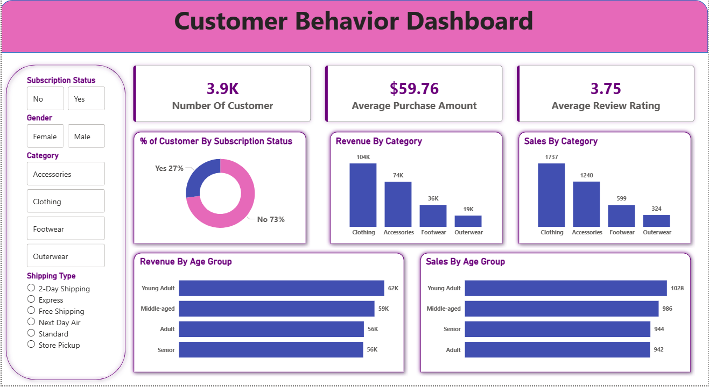

# 📊 Customer Behavior & Engagement Analysis

---

## 🚀 Project Overview

This project analyzes customer shopping behavior and engagement patterns using **Python, SQL, Excel, and Power BI**.  
The goal is to uncover purchasing trends, identify high-value customer segments, evaluate engagement levels, and generate **actionable business insights** through interactive dashboards.

---

## 📂 Dataset Information

- 📌 Total Records: **3,900**
- 🧾 Dataset Type: Customer Shopping Behavior Dataset
- 🧩 Features:
  - 👤 Customer demographics  
  - 🛒 Purchase behavior  
  - 🏷️ Product categories  
  - ⭐ Ratings  
  - 💸 Discounts & promotions  
  - 📅 Seasonal trends  
  - 🔁 Subscription & engagement data  

---

## 🛠️ Tools & Technologies

- 🐍 Python (Pandas, NumPy, Matplotlib)
- 🗄️ SQL
- 📊 Power BI
- 📐 DAX
- 📑 Excel

---

## ❓ Key Business Questions

- 💰 Which customer segments generate the highest revenue?
- 🛍️ Which product categories perform best?
- 🎯 How do discounts impact purchases?
- 📆 What are seasonal purchasing trends?
- 🔁 How does engagement influence repeat purchases?

---

## 📊 Analysis Performed

### 🧹 Data Cleaning & Preparation
- Handled missing values and duplicates
- Standardized dataset for analysis

---

### 📈 Exploratory Data Analysis (EDA)
- 👥 Customer demographic analysis
- 🛒 Purchase behavior insights
- 🏷️ Category performance analysis
- 📅 Seasonal trend analysis

---

### 🗄️ SQL Analysis
- 💰 Revenue analysis
- 👤 Customer spending patterns
- 🏷️ Product performance analysis
- ⭐ Rating analysis

---

### 📊 Dashboard Development (Power BI)
- Built interactive dashboards with slicers & filters
- Created KPI tracking system
- Developed customer segmentation views
- Enabled drill-down analysis

---

## 📌 Key KPIs

- 👥 Total Customers
- 💰 Total Revenue
- 🛒 Average Purchase Value
- ⭐ Average Rating
- 🏷️ Revenue by Category
- 📅 Revenue by Season
- 👤 Customer Segment Performance

---

## 📁 Project Files

- 📄 `Customer_Behavior_Analysis_Data.csv`
- 📓 `Customer_Behavior_Analysis.ipynb`
- 🗄️ `Customer_Behavior_Analysis_SQL.sql`
- 📊 `Customer_Behavior_Engagement_Dashboard.pbix`
- 🖼️ `dashboard-overview.png`

---

## 📸 Dashboard Preview

  

---

## 🧠 Skills Demonstrated

- 🧹 Data Cleaning & Preparation
- 📊 Exploratory Data Analysis (EDA)
- 🗄️ SQL Querying
- 📈 Data Visualization
- 📊 Dashboard Development
- 🧠 Data Modeling
- 💼 Business Intelligence
- 📌 KPI Reporting

---

## 👨‍💻 Author

**Aditya Sakhuja**

🔗 LinkedIn: https://www.linkedin.com/in/aditya-sakhuja-508b33274/  
🐙 GitHub: https://github.com/AdityaSakhuja18  

---

## ⭐ Project Impact

This project demonstrates how raw customer data can be transformed into **actionable business insights** using modern data analytics tools.
